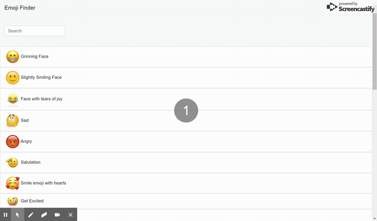

# Emoji Finder

## Summary
This is a simple search application exclusively for emoticons.  One could search for an emoji from list of emoticons

## Installation Guide
* User has to download all files from GitHub repository
* User can either clone the repository or can download all files manually unzipping might take a while though
* `Package.json` file has required depencies to be installed. So, user can type `npm install` to install all needed packages
* User can create a new react application by using `create-react-app <your app name>`
* Once your react app is created, user can type `npm start` to run the application

## Technologies Used
- HTML : Basic skeleton of application basically used to append react components to DOM
- Bootstrap : For application styling
- React : Javascript library for building user interfaces

## Application Functioning
Type `npm start` from command line. Functioning of application is shown below



On run of the application shows list of emoticons. On search of application you can see the list narrows down based on the letters typed by users

## Code Snippet

*Display List Component*

```R
export function DisplayList({ children }) {
    return <ul className="list-group">{children}</ul>;
}

export function DisplayListItem(props) {
    return (
        <div>
            <li className="list-group-item">
                </img>   {props.name}</li>
        </div>
    )
}
```
> This component shows how all emoticons are dislayed

*Search Bar component*

```R
                {this.state.render &&
                    <DisplayList>
                        <DisplayListItem
                            key={this.state.emoji.id}
                            name={this.state.emoji.name}
                            image={this.state.emoji.image}
                        />
                    </DisplayList>}
```
## Learning Points

On developing this application, gained a lot knowledge on react and it's functionality. Was able to have visualize understanding of react components

## Author Links
[LinkedIn](https://www.linkedin.com/in/mahisha-gunasekaran-0a780a88/)

[GitHub](https://github.com/Mahi-Mani)
